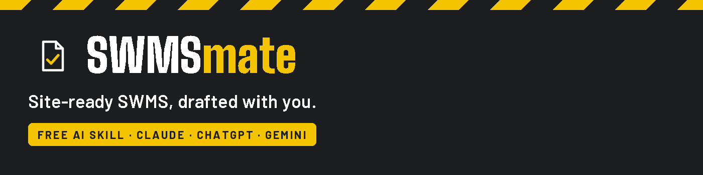
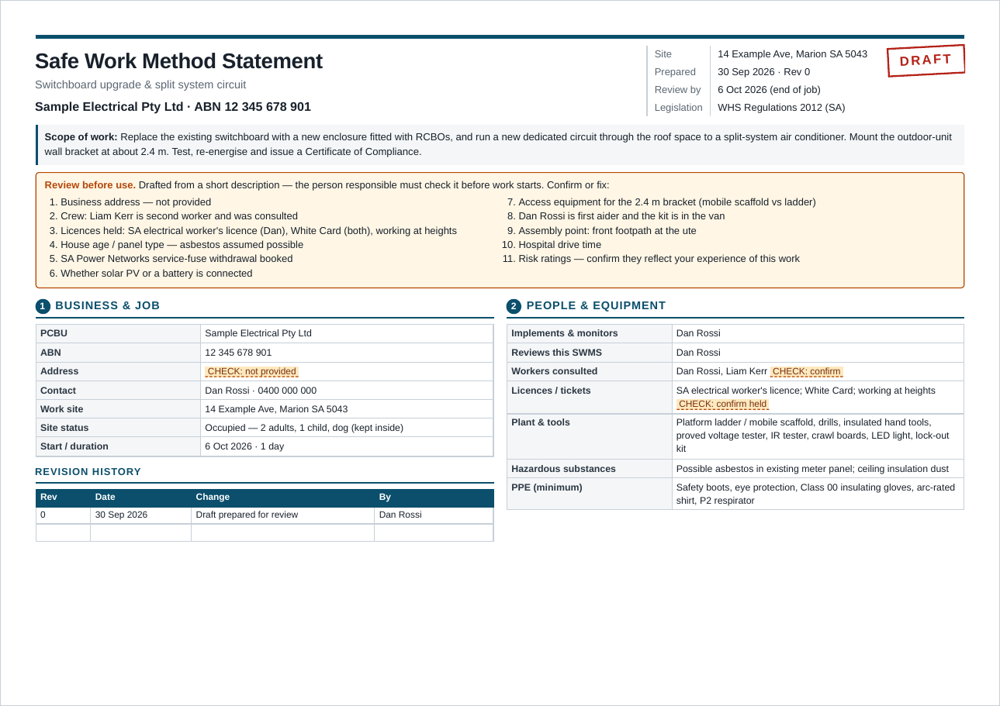
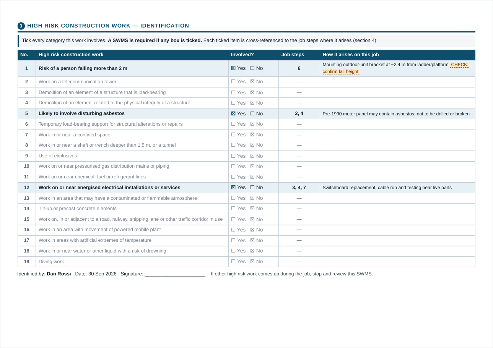
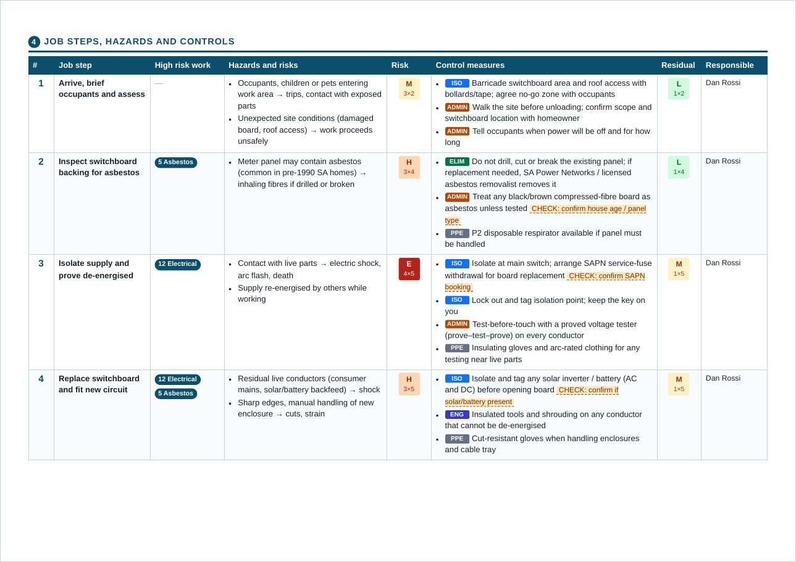

<p align="center">
  
</p>

# SWMSmate

**Draft a Safe Work Method Statement in minutes by answering six quick questions.**

**Official Website:** [http://swmsmate.com.au/](http://swmsmate.com.au/)
SWMSmate is a free AI skill for Australian tradies and small businesses. Describe the job in your own words. It works out the high risk construction work involved, the job steps, hazards and controls, then gives you a clean, landscape A4 SWMS ready to review, print and sign.

It works with **Claude**, **ChatGPT** and **Gemini**.

| | |
|---|---|
| [**Claude**](claude/) | Claude Code, Claude desktop / web, Cowork. The original and most complete version (creates the PDF for you). |
| [**ChatGPT**](chatgpt/) | ChatGPT skill (Business / Enterprise / Edu), or a ChatGPT Project on any plan. |
| [**Gemini**](gemini/) | Gemini skill (personal Google accounts), or a Gem on Google Workspace. |

---

## How it works

1. **You ask:** *"Make me a SWMS."*
2. **It asks six things in one message:** your business (name, ABN, state), the job, the site (or "generic" for any house), who the work is for, when, and who's in charge.
3. **It works out the rest:**
   - which of the 19 high risk construction work categories apply
   - job steps, hazards and tagged controls
   - state legislation and regulator
   - nearest hospital, review triggers and review date
4. **It confirms once:** a one-screen summary, plus *"Include risk ratings?"*
5. **You get the SWMS**, with every assumption highlighted for you to check.

## What's in the SWMS

| Page | Contents |
|---|---|
| **1. Cover** | Scope of work, a **Review before use** checklist of everything it assumed, business and job details, people, licences, plant and PPE, revision history |
| **2. High risk work** | All 19 HRCW categories with Yes/No ticks, the job steps each one applies to, and how it arises on this job |
| **3+. Job steps** | Step by step: high risk work involved, hazards, controls tagged by the hierarchy of controls (ELIM / SUB / ISO / ENG / ADMIN / PPE), who's responsible, and optional before/after **risk ratings** with a 5×5 matrix |
| **Last** | Emergency details, how controls are implemented, monitored and reviewed, the mandatory review triggers, legislation, and worker sign-on |

### Options

- **Specific site or generic.** Use one SWMS for every house you work at. A generic SWMS adds a **site check** page to fill in at each property before work starts, as the Construction Work Code of Practice requires.
- **Your own customer or subcontracting.** When working for a builder or head contractor, it adds "Engaged by", principal contractor details (where they apply), their site rules, and a review/acceptance box for them to sign.
- **Risk ratings on or off.** It suggests ratings when you're working for a builder, and none for your own domestic jobs.
- **Landscape (default) or portrait.**
- **All states and territories.** Harmonised WHS states (SA, NSW, QLD, TAS, ACT, NT), WA (3 m falls threshold for residential work) and VIC (OHS Regulations).

## Example

A fictional switchboard upgrade in Marion, SA, with risk ratings on. [Download the full PDF](examples/SWMS-example-switchboard-upgrade.pdf).

<p align="center">
  
  
  
</p>

## Install

Pick your AI and follow its guide:

- **Claude:** [claude/README.md](claude/README.md). Copy one folder for Claude Code, or upload a zip in the Claude app.
- **ChatGPT:** [chatgpt/README.md](chatgpt/README.md). Upload a skill (Business/Enterprise/Edu), or set up a Project (any plan).
- **Gemini:** [gemini/README.md](gemini/README.md). Upload one file as a skill (personal accounts), or create a Gem (Workspace).

Quick start for Claude Code:

```bash
git clone https://github.com/Dropwire-Digital/SWMSmate.git
mkdir -p ~/.claude/skills && cp -r SWMSmate/claude/swmsmate ~/.claude/skills/
```

## Repository layout

```
SWMSmate/
├── README.md
├── LICENSE
├── assets/                 header and example images
├── examples/               example SWMS (PDF + HTML)
├── claude/
│   ├── swmsmate/SKILL.md   Claude skill
│   ├── swmsmate.zip        for upload to Claude apps
│   └── README.md           install guide
├── chatgpt/
│   ├── swmsmate/           ChatGPT skill (SKILL.md + references/ + assets/)
│   ├── swmsmate.zip        for upload to ChatGPT
│   ├── project-instructions.md
│   └── README.md
└── gemini/
    ├── swmsmate/SKILL.md   Gemini skill (also the Gem knowledge file)
    ├── gem-instructions.md
    └── README.md
```

## Important: it's a draft, not a guarantee

SWMSmate produces a **draft** to speed up your paperwork. It doesn't replace your judgement, and it doesn't replace consulting your workers.

- **Review everything** before use: every highlighted **CHECK** item and the **Review before use** list on page 1.
- **The SWMS must match the actual work and site.** For a generic SWMS, complete the site check at every property.
- **Workers must read and sign it** before work starts, and the work must be done the way the SWMS says.
- **Keep it at the workplace** for the duration of the work, and review it when anything changes.
- AI can make mistakes. Legislation and codes of practice change, so check current requirements with your state regulator: SafeWork SA, SafeWork NSW, WorkSafe QLD, WorkSafe Victoria, WorkSafe WA, WorkSafe Tasmania, WorkSafe ACT or NT WorkSafe.

This project is general information, not legal or WHS advice. You remain responsible for your SWMS and your site.

## Licence

[MIT](LICENSE). Free to use, copy, modify and share, including commercially, as long as the copyright notice stays with it. The software comes with no warranty: see the disclaimer above and the licence text.

## Feedback

Found a problem, or want a trade-specific improvement? [Open an issue](https://github.com/Dropwire-Digital/SWMSmate/issues).

---

<sub>Made by Dropwire Digital.</sub>
